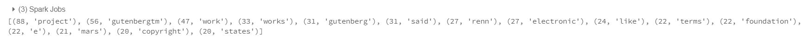
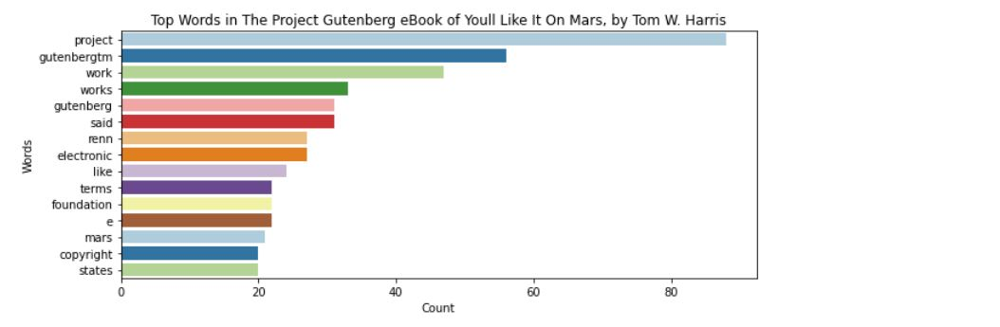

# BigData Final Project

This Repo contains the commands for processing text data using Spark and Python.

## Author:

Rohith Chittimalla - [Repo](https://github.com/rohith0696)

## Tools Used:

- Databricks Community Cloud
- Spark with Python

## Source File:
- The Project Gutenberg eBook of You'll Like It On Mars, by Tom W. Harris - (https://www.gutenberg.org/files/65122/65122-0.txt)

## Published link in Databricks:
- [Click Here](https://databricks-prod-cloudfront.cloud.databricks.com/public/4027ec902e239c93eaaa8714f173bcfc/3627972715711551/2869711375879894/5564532796524935/latest.html)

## Commands to process the Data:

- First we need to retrieve the text data from the URL using 'urllib' and importing the data into tmp folder.

```
import urllib.request
stringInURL = "https://www.gutenberg.org/files/65122/65122-0.txt"
urllib.request.urlretrieve(stringInURL, "/tmp/finProj_data.txt")
```

- Moving the file from tmp folder to dbfs to process the data

```
dbutils.fs.mv("file:/tmp/finProj_data.txt", "dbfs:/data/finProj_data.txt")
```

- Transeferring file to Spark Job

```
rawRDD = sc.textFile("dbfs:/data/finProj_data.txt")
```

### Cleaning the Data

- Splitting the data with space and converting them into lowercase.

```
textRDD = rawRDD.flatMap(lambda line : line.lower().strip().split(" "))
```

- Removing the punctuations from the text by using regular expression

``` import re
cleanTextRDD = textRDD.map(lambda words: re.sub(r'[^a-zA-Z]','',words))
from pyspark.ml.feature import StopWordsRemover
remove = StopWordsRemover()
stopwords = remove.getStopWords()
cleanDataRDD = cleanTextRDD.filter(lambda word: word not in stopwords)
```

- Removing the spaces
```
removeRDD = cleanDataRDD.filter(lambda r: r !="")
```

- Mapping words to key value pairs
```
IKVPairsRDD= removeRDD.map(lambda word: (word,1))
wordsCountRDD = IKVPairsRDD.reduceByKey(lambda acc, value: acc+value)
```

- Printing 15 results of the word count
```
results = wordsCountRDD.map(lambda x: (x[1], x[0])).sortByKey(False).take(15)
print(results)
```

- Converting entire word count in the text using collect() action
```
finalResults = wordsCountRDD.collect()
print(finalResults)
```

### Charting the Data   

- In order to display the results in the form of a chart we need to import the following commands
```
import numpy as np
import pandas as pd
import matplotlib.pyplot as plot
import seaborn as sns
from collections import Counter
```

- chart information
```
source = 'The Project Gutenberg eBook of Youll Like It On Mars, by Tom W. Harris'
title = 'Top Words in ' + source
xlabel = 'Count'
ylabel = 'Words'
```
- create Pandas dataframe from list of tuples
```
df = pd.DataFrame.from_records(results, columns =[xlabel, ylabel]) 
print(df)
```

- create plot (using matplotlib)
```
plot.figure(figsize=(10,4))
sns.barplot(xlabel, ylabel, data=df, palette="Paired").set_title(title)
```

## Results:

- Top 15 Words


- Displaying the top 15 words in the form of chart.



## References:

- https://www.gutenberg.org/
- https://datascience-enthusiast.com/Python/cs110_lab3a_word_count_rdd.html
